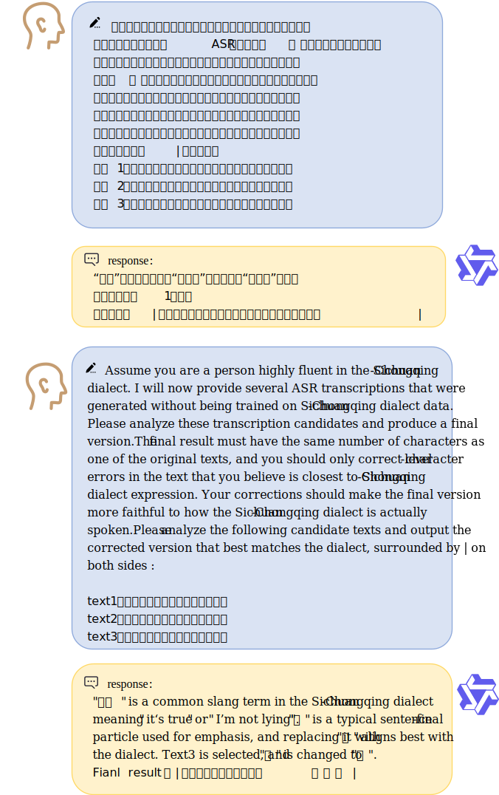

# WenetSpeech-Chuan: A Large-Scale Multi-label Chuan-Yu Chinese dialect Corpus for Speech Recognition and Synthsis
Yuhang Dai, Ziyu Zhang, Hongfei Xue, Longhao Li, Zhao Guo, Qing Wang, Tianlun Zuo, Shuiyuan Wang, Chengyou Wang, Lei Xie, Xin Xu, Hui Bu, Jie Li, Jian Kang, Binbin Zhang

<p align="center">
🌐 <a href="https://huggingface.co/spaces/ASLP-lab/WenetSpeech-Chuan"> Huggingface Space</a> &nbsp&nbsp  |   &nbsp&nbsp 🤖 <a href="https://huggingface.co/ASLP-lab/WSChuan-ASR"> ASR Models</a>
<br>
📑 <a href="https://www.arxiv.org/abs/2508.09600">Paper</a> &nbsp&nbsp  |  &nbsp&nbsp 🎤 <a href="https://llh666521.github.io/WenetSpeech-Yue/">Demo Page</a> &nbsp&nbsp | &nbsp&nbsp 💬 <a href="https://github.com/llh666521/WenetSpeech-Yue?tab=readme-ov-file#contact">Contact Us</a>&nbsp&nbsp 
</p>
<p>
    
    
    
</p>
This is the official repository 👑 for the WenetSpeech-Chuan dataset and the source code for Chuan-Pipe speech data preprocessing pipeline.

## Download
* The WenetSpeech-Chuan dataset is available at [WenetSpeech-Chuan](https://huggingface.co/datasets/ASLP-lab/WSChuan-Train).
* The WSChuan-eval benchmark is available at [WSChuan-ASR-eval](https://huggingface.co/datasets/ASLP-lab/WSChuan-Eval) and [WSChuan-TTS-eval](https://huggingface.co/datasets/ASLP-lab/WSChuan-Eval).
* The ASR models are available at [WSChuan-ASR](https://huggingface.co/ASLP-lab/WSChuan-ASR).
* The TTS models are available at [WSChuan-TTS](https://huggingface.co/ASLP-lab/WSChuan-TTS).

## ASR Leaderboard
| Model                                     | Model Size | WSC-Eval-ASR Short | WSC-Eval-ASR Long | WSC-Eval-ASR Total | Magiedata Dialogue | Magiedata Scripted_text | SPEECHIO ASR00041 | Avg   |
|-------------------------------------------|------------|--------------------|-------------------|--------------------|--------------------|-------------------------|--------------------|-------|
| **✨ w/ LLM ✨**                           |            |                    |                   |                    |                    |                         |                    |       |
| Kimi-Audio                           | 7B         | 18.25              | 13.52             | 17.66              | 24.66              | 7.01                    | 19.91              | 16.84 |
| FireRed/ASR-LLM                      | 8.3B       | 14.57              | 13.10             | 14.4               | 18.32              | 7.08                    | 13.26              | 13.46 |
| Qwen2.5-omni                         | 3B         | 18.55              | 20.28             | 15.96              | 21.34              | 7.16                    | 27.13              | 18.40 |
| *🎯 Qwen2.5-omni-WenetSpeech-Chuan-Finetune* | 3B         | 15.89              | 13.07             | 15.88              | 17.94              | 7.75                    | 22.39              | 15.48 |
| **🔧 w/o LLM 🔧**                          |            |                    |                   |                    |                    |                         |                    |       |
| SenseVoice-small                     | 234M       | 18.62              | 16.75             | 18.39              | 18.39              | 9.98                    | 25.5               | 18.05 |
| Whisper                              | 244M       | 53.89              | 51.76             | 53.59              | 56.49              | 52.63                   | 50.6               | 54.15 |
| FireRedASR-AED                       | 1.1B       | 14.95              | 12.32             | 15.4               | 18.32              | 7.6                     | 14.61              | 13.86 |
| Paraformer                           | 220M       | 15.99              | 13.37             | 15.66              | 20.97              | 9.92                    | 21.96              | 16.82 |
| *🎯 Paraformer-WenetSpeech-Chuan-Finetune*   | 220M       | <u>13.73</u>              | <u>11.86</u>             | <u>13.51</u>              | <u>17.05</u>              | 9.08                    | 20.97              | 14.75 |
| *🏆 Paraformer-WenetSpeech-Chuan-Finetune + In-house data* | 220M | **13.09**              | **11.60**             | **12.87**              | **15.62**              | **6.68**                    | 19.76              | **13.27** |


## Dataset
### WenetSpeech-Chuan Overview
* Contains 10,000 hours of large-scale Chuan-Yu dialect speech corpus with rich annotations, the largest open-source resource for Chuan-Yu dialect speech research.
* Stores metadata in a single JSON file, including audio path, duration, text confidence, speaker identity, SNR, DNSMOS, age, gender, and character-level timestamps. Additional metadata tags may be added in the future.
* Covers ten domains: Short videos, Entertainment, Live streams, Documentary, Audiobook, Drama, Interview, News and others.
<div align="center"></div>

## Benchmark
To address the unique linguistic characteristics of Chuan-Yu dialect, we propose WSChuan-eval, a comprehensive benchmark encompassing both Automatic Speech Recognition (ASR) and Text-to-Speech (TTS) tasks.

### ASR Benchmark
We introduce WSChuan-ASR-eval, a test set developed for Automatic Speech Recognition (ASR) as a key task in speech understanding. It features **multi-round manual annotations** including text transcripts, emotion, age, and gender labels. The set is divided into Short and Long subsets by audio duration to enable comprehensive evaluation across speech lengths. WSChuan-ASR-eval also covers diverse real-world Chuan-Yu scenarios.

| Set   | Duration | Utterances | Hours |
|-------|----------|------------|-------|
| Short | 0–10s    |    8051    | 8.50  |
| Long  | 10–30s   |    690     | 2.61  |

### TTS Benchmark
We introduce WSChuan-TTS-eval, a zero-shot Cantonese TTS benchmark with two subsets:
- Base: Contains 1,000 samples from Common Voice for evaluating real-world performance.
- Coverage: Combines manually curated and LLM-generated texts spanning multiple domains (e.g., daily life, news, entertainment, poetry) and incorporates diverse linguistic phenomena including polyphonic characters, tone sandhi, code-switching, proper nouns, and numerals.

<!-- ## ASR Inference
### U2pp_Conformer_Yue
```
dir=u2pp_conformer_yue
decode_checkpoint=$dir/u2pp_conformer_yue.pt
test_set=path/to/test_set
test_result_dir=path/to/test_result_dir

python wenet/bin/recognize.py \
  --gpu 0 \
  --modes attention_rescoring \
  --config $dir/train.yaml \
  --test_data $test_set/data.list \
  --checkpoint $decode_checkpoint \
  --beam_size 10 \
  --batch_size 32 \
  --ctc_weight 0.5 \
  --result_dir $test_result_dir \
  --decoding_chunk_size -1
```
### Whisper_Medium_Yue
```
dir=whisper_medium_yue
decode_checkpoint=$dir/whisper_medium_yue.pt
test_set=path/to/test_set
test_result_dir=path/to/test_result_dir

python wenet/bin/recognize.py \
  --gpu 0 \
  --modes attention \
  --config $dir/train.yaml \
  --test_data $test_set/data.list \
  --checkpoint $decode_checkpoint \
  --beam_size 10 \
  --batch_size 32 \
  --blank_penalty 0.0 \
  --ctc_weight 0.0 \
  --reverse_weight 0.0 \
  --result_dir $test_result_dir \
  --decoding_chunk_size -1
``` -->

## Chuan-Pipe
Chuan-Pipe Overview:
<div align="center"></div>
### Audio Collection
Chuan-Pipe collects large-scale, in-the-wild speech recordings across diverse domains such as storytelling, drama, commentary, vlogs, food, entertainment, news, and education. These long recordings are segmented into short clips with VAD, yielding utterance-level data for transcription and quality evaluation.


### Speaker Attribute Annotation
To enrich the dataset with speaker-level metadata for multi-speaker modeling and style-aware synthesis, WenetSpeech-Pipe includes a Speaker Attributes Annotation stage. Using [pyannote](https://github.com/pyannote/pyannote-audio) toolkit for speaker diarization and [Vox-Profile](https://github.com/tiantiaf0627/vox-profile-release) for age and gender estimation, each utterance-level segment is annotated with speaker identity, age, and gender, enabling supervised and style-controllable speech modeling.

### Speech Quality Annotation
To support high-fidelity tasks such as TTS and voice conversion, WenetSpeech-Pipe integrates a comprehensive quality assessment stage. Each segment is evaluated by (i) [Brouhaha](https://github.com/marianne-m/brouhaha-vad) for signal-to-noise ratio (SNR), (ii) [DNSMOS](https://github.com/microsoft/DNS-Challenge) for perceptual quality (MOS), and (iii) bandwidth detection for spectral coverage. These complementary measures yield structured annotations with quantitative scores and spectral references.
<div align="center"></div>


### Automatic Speech Recognition
We select three models with the best performance on Cantonese to perform multi-system labeling: SenseVoice, TeleASR, and Whisper. For each audio file, we obtain the corresponding multi-system transcriptions.

### LLM Generative Error Correction based ROVER (LLM-GER)
Based on prior research ([GER](https://arxiv.org/pdf/2507.09116), [MMGER](https://arxiv.org/abs/2405.03152)), we propose a robust post-processing method for the Chuan-Yu dialect to consolidate multiple ASR outputs into a single high-quality transcription, namely LLM Generative Error Correction based ROVER (LLM-GER). LLM-GER leverages the strong dialectal semantic understanding capability of Qwen3 to evaluate and integrate candidate outputs from multiple ASR systems. By constraining the model not to alter the original semantics or token length, LLM-GER effectively corrects dialect-related transcription errors while preserving the integrity of the input.

<div align="center"></div>


## Citation
Please cite our paper if you find this work useful:
```

```

## Contact
If you are interested in leaving a message to our research team, feel free to email lhli@mail.nwpu.edu.cn or gzhao@mail.nwpu.edu.cn.
<p align="center">
    <br>
    
    <br>
</p>